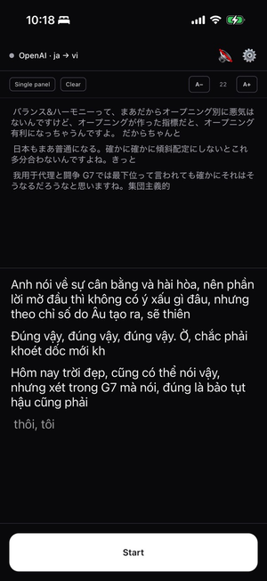
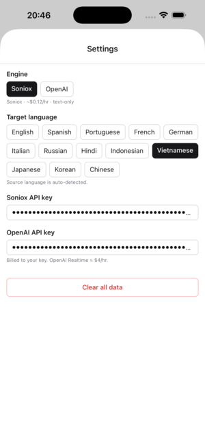
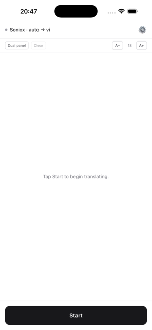

<div align="center">


# My Translator — Mobile

**Live translation for talks and lectures.**
Point your phone at the speaker, read the talk in your language, in real time.

A lightweight stand-in for a human cabin (booth) interpreter when there isn't one.

</div>

---

## Install

### iPhone / iPad — TestFlight

1. Install **[TestFlight](https://apps.apple.com/app/testflight/id899247664)** from the App Store.
2. Open this link on your device → tap **Accept** → **Install**:

   **https://testflight.apple.com/join/Fw9VJXfE**

### Android — APK

1. Open the **[latest release](https://github.com/phuc-nt/my-translator-mobile/releases/latest)** on your phone and download the `.apk`
   ([direct download](https://github.com/phuc-nt/my-translator-mobile/releases/download/v0.2.0-android/my-translator-0.2.0.apk)).
2. Allow your browser to "install unknown apps" when prompted.
3. Open the file → **Install** (tap **Install anyway** if Play Protect warns).

---

## First-run setup

1. Open the app — it sends you straight to **Settings** (no API key saved yet).
2. Paste **one** API key:
   - **Soniox** — get one at <https://console.soniox.com>. Cheap (~$0.12/hr), text only. **Recommended.**
   - **OpenAI** — get one at <https://platform.openai.com/api-keys>. ~$4/hr, adds spoken voice. Tip: set a low monthly cap.

   Hướng dẫn chi tiết bằng tiếng Việt: [docs/api-key-guide-vi.md](docs/api-key-guide-vi.md)
3. Pick your **target** language (the spoken language is auto-detected).
4. Back on the main screen, tap **Start**, allow the microphone, and listen.
5. On OpenAI: tap 🔇 in the header to unmute voice output.

After **Stop** you can **Copy** / **Share** the transcript, or **Summarize** the
session with OpenAI (needs an OpenAI key — works even after a Soniox session).
Finished sessions are saved on-device; review them under 🕘 in the header.

> Your key stays in the device's secure keychain. Audio goes **straight to the provider you chose** — no backend, no tracking. Session history is stored **only on your device** and never leaves it. See [PRIVACY.md](PRIVACY.md).

---

## Screenshots

<div align="center">





*Live translation · Settings (bring your own key) · Ready to start*

</div>

---

## Engines

| Engine | Cost | Output |
| --- | --- | --- |
| **Soniox** | ~$0.12/hr | On-screen translated text |
| **OpenAI Realtime** | ~$4/hr | Text + optional spoken voice (muted by default) |

Source language is auto-detected — you only pick a target.

---

<details>
<summary><strong>For developers</strong></summary>

### Stack

Expo SDK 54 · React Native 0.81 · TypeScript · Expo Router v4 · NativeWind v4 ·
`react-native-audio-api` (mic + PCM playback) · `expo-secure-store` (keys).
Distribution: EAS Build → TestFlight (iOS) + APK on GitHub Release (Android).

### Develop

```bash
npm install
npx expo prebuild --clean
npx expo run:ios       # or: npx expo run:android
# iterate after first native build:
npx expo start --dev-client
```

See [docs/react-native-dev-vs-production.md](docs/react-native-dev-vs-production.md)
for how the dev client / Metro / production builds differ, and
[docs/eas-update-guide.md](docs/eas-update-guide.md) for shipping OTA
(over-the-air) JS updates without a rebuild.

### Build & ship

```bash
npm i -g eas-cli && eas login

# iOS → TestFlight
eas build --profile production --platform ios
eas submit --platform ios --latest

# Android → APK (download artifact, attach to a GitHub Release)
eas build --profile production --platform android
```

`eas.json` profiles: `development` (dev client), `preview` (internal APK / ad-hoc iOS), `production` (TestFlight + signed APK).

### Layout

```
app/        Expo Router screens (index = translate, settings)
src/
  engines/    soniox-client.ts, openai-realtime-client.ts
  lib/        audio-capture, audio-output-queue, secure-keys, languages
  components/ transcript-stream.tsx
  state/      Settings + Session contexts
```

</details>

## License

Same as desktop [my-translator](https://github.com/phuc-nt/my-translator).
