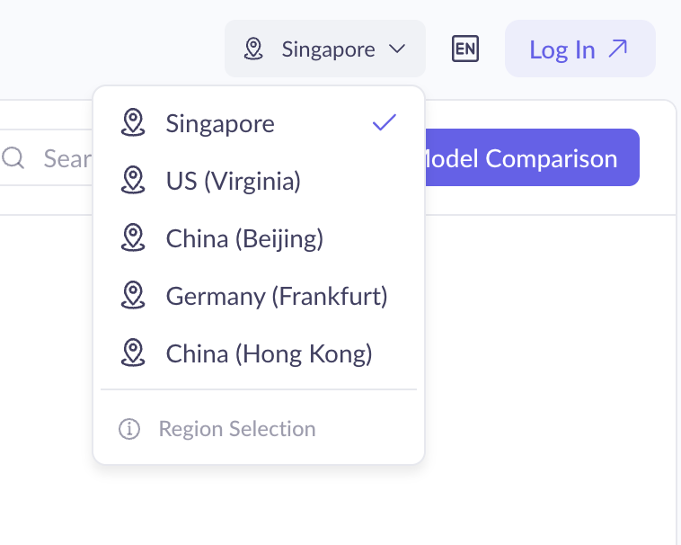
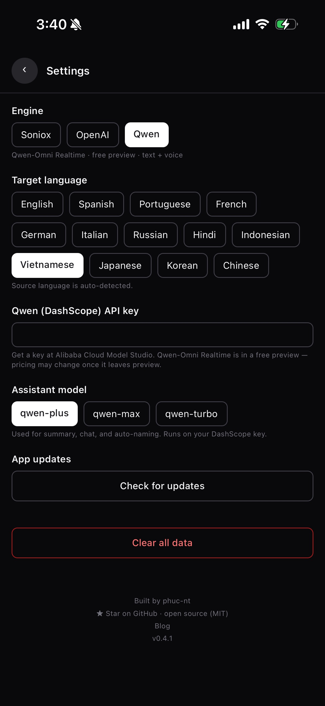

# Hướng dẫn lấy API key (Tiếng Việt)

My Translator không có server riêng. Bạn tự tạo API key của Soniox, OpenAI
hoặc Qwen, dán vào app, và app gửi âm thanh thẳng tới nhà cung cấp đó. Key được
lưu trong keychain bảo mật của máy, không gửi đi đâu khác.

Chỉ cần **một** trong ba key là dùng được.

| Nhà cung cấp | Giá tham khảo | Đầu ra | Gợi ý |
| --- | --- | --- | --- |
| **Soniox** | ~$0.12/giờ | Văn bản dịch trên màn hình | Rẻ, **nên dùng** |
| **OpenAI Realtime** | ~$4/giờ | Văn bản dịch trên màn hình | Chất lượng dịch cao |
| **Qwen-Omni Realtime** | Bản xem trước miễn phí | Văn bản dịch trên màn hình | Đang miễn phí, giá có thể đổi |

> Từ bản 0.4.2, giọng đọc tự động (TTS) đã được tắt ở cả OpenAI và Qwen vì
> loa máy phát ra sẽ vọng lại vào mic và gây lặp vô hạn. Bản dịch chỉ hiển
> thị bằng văn bản trên màn hình.

---

## 1. Soniox (khuyến nghị)

1. Mở <https://console.soniox.com> và đăng ký tài khoản (email hoặc Google).
2. Xác nhận email nếu được yêu cầu, rồi đăng nhập vào Console.
3. Vào mục **API Keys** ở menu bên trái.
4. Bấm **Create API key**, đặt tên bất kỳ (ví dụ: `my-translator`).
5. **Sao chép key ngay** — Soniox chỉ hiển thị đầy đủ một lần. Nếu mất phải tạo key mới.
6. Tài khoản mới thường có sẵn credit dùng thử miễn phí, đủ để test ngay.
7. Mở app My Translator → màn hình **Settings** → dán key vào ô **Soniox**.

> Để dùng lâu dài, vào mục **Billing** trong Console để nạp tiền hoặc gắn thẻ.
> Soniox tính theo thời lượng âm thanh thực tế (~$0.12/giờ), chỉ có văn bản.

---

## 2. OpenAI Realtime (chất lượng dịch cao)

1. Mở <https://platform.openai.com/api-keys> và đăng nhập (hoặc tạo tài khoản).
2. Nếu là tài khoản mới: vào **Settings → Billing** và nạp tối thiểu một khoản
   tín dụng — OpenAI Realtime **không** dùng được nếu chưa có credit.
3. **Đặt hạn mức chi tiêu (quan trọng):** vào **Settings → Limits**, đặt
   *Monthly budget* ở mức thấp (ví dụ $5–$10) để tránh bị tính tiền ngoài ý muốn.
   Realtime ~$4/giờ nên rất dễ vượt nếu để quên.
4. Quay lại trang **API keys**, bấm **Create new secret key**, đặt tên
   (ví dụ: `my-translator`).
5. **Sao chép key ngay** — OpenAI chỉ hiển thị một lần duy nhất.
6. Mở app My Translator → màn hình **Settings** → chọn engine **OpenAI** rồi
   dán key vào ô **OpenAI**.

---

## 3. Qwen / DashScope (miễn phí, đang preview)

> ⚠️ **QUAN TRỌNG — phải chọn region Singapore.** App kết nối tới endpoint
> quốc tế `dashscope-intl.aliyuncs.com`. Key tạo ở region khác (China Beijing,
> Hong Kong, US Virginia, Germany Frankfurt) sẽ bị reject và app báo
> `WebSocket error` ngay khi bấm Start.

1. Mở <https://bailian.console.alibabacloud.com> (Alibaba Cloud Model Studio).
2. **Trước khi đăng nhập / đăng ký**, bấm vào dropdown region ở góc trên bên
   phải và chọn **Singapore** (xem ảnh dưới). Nếu lỡ login ở region khác rồi,
   switch sang Singapore — có thể phải đăng ký workspace riêng cho region này.

   

3. Sau khi vào Console (đảm bảo góc trên vẫn hiển thị "Singapore"), kích hoạt
   dịch vụ **Model Studio (DashScope)** nếu được nhắc.
4. Vào mục **API Keys**, bấm **Create API Key**, đặt tên bất kỳ.
5. **Sao chép key ngay** — chỉ hiển thị đầy đủ một lần.
6. Mở app My Translator → màn hình **Settings** → chọn engine **Qwen**, chọn
   ngôn ngữ đích, rồi dán key vào ô **Qwen (DashScope)** như ảnh dưới.

> Qwen-Omni Realtime hiện ở giai đoạn **xem trước (preview)** và miễn phí gọi
> mô hình. Giá có thể thay đổi khi rời preview — theo dõi thông báo của Alibaba Cloud.

### Khắc phục lỗi `WebSocket error` khi dùng Qwen

| Triệu chứng | Nguyên nhân thường gặp | Cách sửa |
| --- | --- | --- |
| Báo `WebSocket error` ngay khi bấm Start | Key tạo ở region khác Singapore | Tạo lại key ở region Singapore (xem mục 2 ở trên) |
| Báo lỗi sau ~5–10 giây | Key đúng region nhưng chưa kích hoạt model Qwen-Omni Realtime | Vào Model Studio → Model Square → bật `qwen3-omni-flash-realtime` |
| Báo lỗi không ổn định | Mạng chặn `dashscope-intl.aliyuncs.com` (firewall công ty / VPN) | Thử mạng khác (4G/5G) hoặc tắt VPN |

---

## Lưu ý bảo mật

- Key giống như mật khẩu — **không chia sẻ, không chụp màn hình gửi cho ai**.
- Nếu lỡ để lộ: vào lại trang quản lý key của nhà cung cấp, **xoá (revoke)**
  key cũ và tạo key mới.
- App chỉ lưu key trong keychain của máy bạn. Gỡ app là key mất theo.
- Không có lịch sử bản dịch, không backend, không tracking. Xem [PRIVACY.md](../PRIVACY.md).
